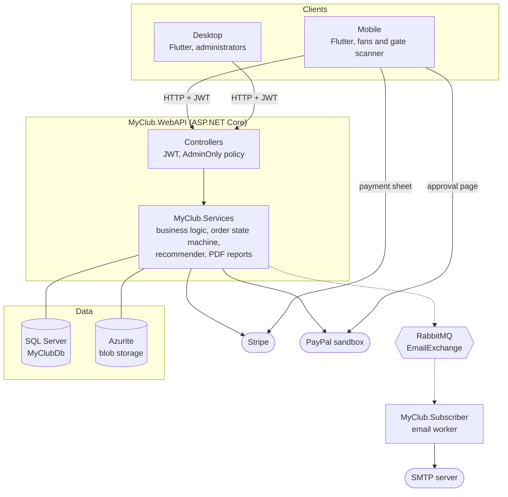
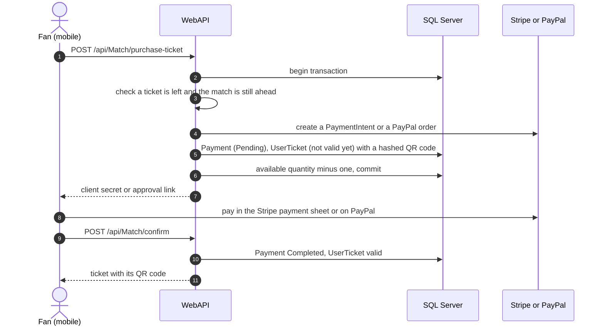
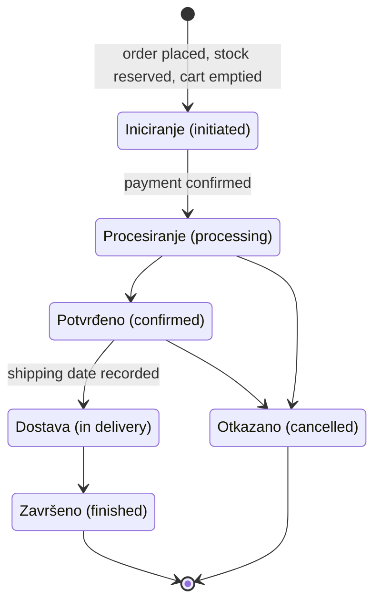
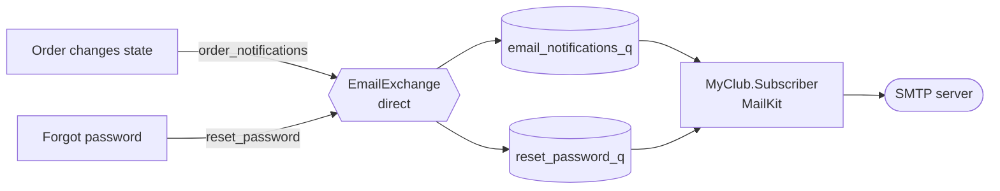
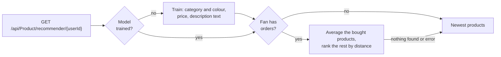

<h1 align="center">MyClub</h1>

<p align="center">
  A management platform for a football club: the fan shop, match tickets, yearly memberships,
  club news and the squad, all on one backend.<br>
  Built as a .NET Web API with an email worker on RabbitMQ, two Flutter apps, Stripe and PayPal
  payments, machine-learning product recommendations, and QR tickets scanned at the stadium gate.
</p>

<p align="center">
  
  
  
  
  
  
  
  
  
  
</p>

All user-facing text in the apps is in Bosnian. Code and this documentation are in English.

## Contents

- [Who does what](#who-does-what)
- [Architecture](#architecture)
- [Product recommendations](#product-recommendations)
- [Match day: tickets at the gate](#match-day-tickets-at-the-gate)
- [How it is built](#how-it-is-built)
- [Getting started](#getting-started)


## Who does what

There are two roles:

- **Administrator**: club staff, who run the club from the **desktop** back office.
- **User**: fans, who shop, buy tickets and memberships in the **mobile** app.

The desktop app refuses any account that is not an Administrator. In the mobile app, an
Administrator gets only the ticket scanner used at the stadium gate. On the API, catalogue writes,
order management and the dashboard are guarded by the `AdminOnly` policy.

### Administrator

Works in the desktop app, which has one tab per area:

- *Analitika* (analytics): orders, members, revenue per month, sales per category and the
  best-selling product, plus four PDF reports: top 10 best-selling products, top 10 least-sold
  products, members per month and revenue per month.
- *Narudžbe* (orders): moves each order through its lifecycle. Every change emails the buyer.
- *Fan Shop*: products with photos, barcode, price, colour, category and stock per size, plus the
  categories, colours and sizes themselves.
- *Vijesti* (news): club news with photos and a video link, and their comments.
- *Ulaznice* (tickets): releases tickets for a match, per stadium sector, with a price and quantity.
- *Članstvo* (membership): yearly membership campaigns with a price, dates, benefits and a target
  number of members.
- *Korisnička članstva* (members): who joined, and which physical cards have been shipped.
- *Igrači* (players): the squad, with position, shirt number, nationality, photo and biography.
- *Utakmice* (matches): fixtures against opponents, and the final score.
- *Postavke* (settings): club information, locations (countries and cities) and the stadium
  layout (stands and sectors).

On match day, the Administrator signs in to the mobile app and scans tickets at the gate.

### Fans

- Register, sign in, edit the profile, change the password, or reset a forgotten one with a
  six-digit code sent by email and valid for 15 minutes.
- See the current membership campaign, with progress towards its target, and the club news.
- Browse upcoming matches with ticket prices per sector, and past results. Buy a ticket with Stripe
  or PayPal and keep its QR code in the app.
- Shop in the fan shop with search, a personalised "recommended for you" row, a cart and checkout
  with a shipping address, and follow each order's status.
- Buy the season's membership, optionally with a physical card shipped to an address. The digital
  card shows in the profile and flips over to show its back.
- Read about the club, its players and the coaching staff.

### Permission matrix

| Capability | Administrator | User |
|---|:-:|:-:|
| Desktop back office | ✅ | — |
| Mobile app | ticket scanner only | full app |
| Products, categories, colours and sizes | ✅ | — |
| News | ✅ | — |
| Players, club information, locations and stadium layout | ✅ | — |
| Matches, results and ticket release | ✅ | — |
| Membership campaigns and card shipping | ✅ | — |
| Order status changes | ✅ | — |
| Dashboard and PDF reports | ✅ | — |
| Validate tickets at the gate | ✅ | — |
| Buy tickets, memberships and fan-shop products | — | ✅ |
| Personalised product recommendations | — | ✅ |

### The domain at a glance

| Entity | What it is |
|---|---|
| `StadiumSide` | A stand of the home stadium |
| `StadiumSector` | A block inside a stand, with a code such as `A1` and a seating capacity |
| `Match` | A fixture against an opponent, with its date, location and final score |
| `MatchTicket` | Tickets released for one match in one sector: price, released and available quantity |
| `UserTicket` | One ticket a fan bought, with its QR code, its payment and whether it is still valid |
| `Product`, `ProductSize` | A fan-shop product, and its stock in each size |
| `Order` | A fan-shop order with its items, shipping details, payment and current state |
| `MembershipCard` | One season's membership campaign: price, dates, benefits and target members |
| `UserMembership` | A fan's membership, with its payment and an optional physical card shipment |

## Architecture

MyClub is a **layered Web API** with a separate **email worker**. Everything a fan waits for, such
as a purchase or a login, is answered synchronously over HTTP. Emails go through RabbitMQ, so a
slow mail server never slows down a request.



<sub>Solid arrows are HTTP calls, dotted arrows are RabbitMQ messages, and plain lines connect the API to its data.</sub>

### Components

| Unit | Kind | Responsibility |
|---|---|---|
| **MyClub.WebAPI** | ASP.NET Core Web API | Controllers, JWT authentication, the `AdminOnly` policy, Swagger, a global error filter |
| **MyClub.Services** | Class library | EF Core context and seed data, business services, the order state machine, Stripe and PayPal, the recommender, PDF reports, blob storage, the RabbitMQ publisher |
| **MyClub.Model** | .NET Standard 2.1 library | Requests, responses and search objects, the email message contract, recommender feature types |
| **MyClub.Subscriber** | Console worker | Consumes email messages from RabbitMQ and sends them over SMTP with MailKit |
| **myclub_desktop** | Flutter desktop app | Back office for administrators |
| **myclub_mobile** | Flutter mobile app | Fan app, and the ticket scanner for administrators |
| **sql, rabbitmq, azurite** | Containers | SQL Server 2022, RabbitMQ 3 with the management UI, the Azurite blob storage emulator |

### Buying a match ticket



The ticket is taken out of the sector's stock in the same transaction that creates the payment, so
two fans cannot both buy the last one. It becomes valid only once the payment is confirmed.
Memberships are paid the same way, through `POST /api/UserMembership/purchase` and then `confirm`.

### Order lifecycle

A fan-shop order moves through six states. Each state is its own class in
`MyClub.Services/OrderStateMachine` (the State pattern) and rejects moves that make no sense from
it, such as reopening a cancelled or finished order.



Every change of state sends the buyer an email through RabbitMQ.

### Emails through RabbitMQ



Both queues are durable. The subscriber tries each email up to three times with a doubling
back-off, then rejects the message without putting it back on the queue.

### Key design decisions

- **Layers in one direction**: `WebAPI → Services → Model`. The model library targets .NET
  Standard 2.1, so the email worker shares the same message contract as the API.
- **Generic CRUD base.** `BaseController`, `BaseCRUDController` and their services give every entity
  paging, search objects and get-by-id for free. Writes require `AdminOnly` unless a controller
  says otherwise. Mapster maps entities to responses.
- **State pattern for orders**, so each state owns its allowed transitions and the emails they
  trigger.
- **Stock is reserved up front.** A sector's ticket quantity is decreased inside a database
  transaction when the purchase starts, and product stock per size is decreased when the order is
  placed, before payment.
- **Single-use QR codes.** The payload is the user, match, sector, quantity and a timestamp,
  followed by a SHA-256 hash of them. The server accepts only a code it issued and stored itself,
  and marks the ticket used on its first valid scan.
- **Emails never block a request.** The API only publishes a message. The worker does the sending.
- **Images in blob storage.** Product, news, player, club and membership images live in Azure Blob
  Storage, emulated locally by Azurite.
- **One error shape.** A global filter turns a `UserException` into a `400` with a readable message
  and anything else into a `500`.
- **A database that sets itself up.** On startup the API creates the database, retrying for up to
  20 seconds while the SQL Server container boots, and EF Core `HasData` seeds the club, squad,
  matches, products, orders, news and demo users.

## Product recommendations

The fan shop shows each signed-in fan a "recommended for you" row. It comes from a
**content-based recommender** built with **ML.NET**, running inside the API with no separate model
server. A full write-up (in Bosnian) is in
[recommender-dokumentacija.pdf](MyClub/recommender-dokumentacija.pdf).

- **Features.** Every active product becomes one vector: its category and colour one-hot encoded,
  its price min-max normalised, and its description turned into text features.
- **Taste profile.** A fan's profile is the average vector of every product they have ordered.
- **Ranking.** Products the fan has not bought yet are ranked by Euclidean distance to the profile,
  closest first.
- **Training.** The model trains on the first request, and retraining is throttled to at most once
  every five minutes. The fitted pipeline is saved as `content_recommender_euclid.zip` next to the
  API binaries.
- **A row is never empty.** A fan with no orders yet, or any failure, gets the newest products
  instead.



## Match day: tickets at the gate

Each ticket a fan buys is a QR code in the mobile app. At the gate, an Administrator signs in to
the same app, which opens on the ticket scanner instead of the fan screens. Each scan is sent to
`POST /api/Match/validate-ticket`, and the server decides.

| Situation | Message shown | The ticket afterwards |
|---|---|---|
| Paid ticket for a match that is still ahead | *Karta je validna* (valid) | Marked used, so it cannot get in twice |
| Unknown code, unpaid ticket or already used | *Karta nije validna* (not valid) | Unchanged |
| Kick-off is less than 10 minutes away or has passed | *Utakmica je već odigrana* (already played) | Unchanged |

The server looks the code up among the tickets it issued, so a forged or edited code is rejected.

## How it is built

### Repository layout

```text
MyClub/
├── README.md
└── MyClub/
    ├── MyClub.WebAPI/                  ASP.NET Core Web API: controllers, JWT, filters, Swagger
    ├── MyClub.Services/                EF Core context and seeders, services, order state machine, recommender
    ├── MyClub.Model/                   requests, responses, search objects, email contract
    ├── MyClub.Subscriber/              RabbitMQ consumer that sends emails over SMTP
    ├── UI/
    │   ├── myclub_desktop/             Flutter back office for administrators
    │   └── myclub_mobile/              Flutter app for fans, plus the gate scanner
    ├── docker-compose.yml              API, subscriber, SQL Server, RabbitMQ and Azurite
    ├── Dockerfile                      API image (the subscriber has its own)
    ├── env_file.zip                    the .env file, password protected
    ├── fit-build-2025-25-08.zip        prebuilt Windows desktop app and Android APK
    └── recommender-dokumentacija.pdf   recommender write-up, in Bosnian
```

### Tech stack

| Area | Technology |
|---|---|
| Backend | .NET 8, ASP.NET Core Web API, EF Core 8, Mapster, Swashbuckle (Swagger) |
| Data | SQL Server 2022, Azure Blob Storage (Azurite locally) |
| Messaging and email | RabbitMQ 3 (direct exchange), MailKit over SMTP |
| Payments | Stripe.net and `flutter_stripe`, PayPal Checkout SDK (sandbox) |
| Reports | QuestPDF |
| Machine learning | ML.NET 5.0 preview (one-hot encoding, normalisation, text featurisation) |
| Desktop | Flutter (Dart 3.8) with `provider`, `http`, `fl_chart` and `file_selector` |
| Mobile | Flutter (Dart 3.8) with `provider`, `http`, `qr_flutter`, `mobile_scanner` and `flutter_stripe` |
| Runtime | Docker Compose |

## Getting started

### Prerequisites

- **Docker Desktop** runs the whole backend.
- To use the apps: a Windows PC for the desktop app, and an Android device or emulator for the
  mobile app.
- Optional: the Flutter SDK (Dart 3.8 or newer) to build the apps from source, and the .NET 8 SDK
  to run the API outside Docker.

### 1. Create the `.env` file

The backend is configured by one `.env` file, which is gitignored and shipped in a password-protected
archive.

1. Extract `MyClub/env_file.zip`. The password is **fit**.
2. Copy the `.env` file into the `MyClub/` folder, next to `docker-compose.yml`.

<details>
<summary><b>Environment variables</b></summary>

| Variable | Used for |
|---|---|
| `PORT` | Host port of the API. The apps expect `8080` |
| `ASPNETCORE_ENVIRONMENT`, `ASPNETCORE_URLS` | ASP.NET Core environment and listen address. Swagger is on only in `Development` |
| `SA_PASSWORD`, `MSSQL_PORT` | SQL Server `sa` password and host port |
| `CONNECTIONSTRINGS__DEFAULTCONNECTION` | The API's connection string to SQL Server |
| `CONNECTIONSTRINGS__AZUREBLOBSTORAGE` | Blob storage for images (Azurite locally) |
| `JWTCONFIG__KEY`, `JWTCONFIG__ISSUER`, `JWTCONFIG__AUDIENCE` | Signing and validating the JWTs |
| `STRIPE__SECRETKEY`, `STRIPE__PUBLISHABLEKEY` | Stripe in test mode |
| `PAYPAL__CLIENTID`, `PAYPAL__SECRET`, `PAYPAL__ENVIRONMENT` | PayPal credentials, and `Sandbox` or `Live` |
| `PAYPAL__BRANDNAME`, `PAYPAL__RETURNURL`, `PAYPAL__CANCELURL` | Brand shown on PayPal, and where PayPal returns the buyer |
| `RABBITMQ_HOST`, `RABBITMQ_PORT`, `RABBITMQ_USERNAME`, `RABBITMQ_PASSWORD` | RabbitMQ, shared by the API and the subscriber |
| `SMTP_SERVER`, `SMTP_PORT`, `SMTP_USERNAME`, `SMTP_PASSWORD`, `SMTP_SENDER_NAME` | Outgoing email |
| `MAIL_QUEUE_NAME` | Queue for order emails (default `email_notifications_q`) |

</details>

### 2. Start the backend

```bash
cd MyClub
docker compose up --build
```

| What | Where |
|---|---|
| Web API (desktop and mobile apps) | http://localhost:8080 |
| Swagger UI (when `ASPNETCORE_ENVIRONMENT=Development`) | http://localhost:8080/swagger |
| RabbitMQ management UI | http://localhost:15672 |
| Azurite blob storage | http://localhost:10000 |

The database is created and seeded when the API starts for the first time. The email subscriber
waits about ten seconds for RabbitMQ before it starts consuming.

### 3. Install the apps

Extract `MyClub/fit-build-2025-25-08.zip`, then:

- **Desktop**: run the `.exe` file on Windows.
- **Mobile**: install the `.apk` file on an Android device or emulator.

<details>
<summary><b>Build the apps from source</b></summary>

Both apps take the API address from a `baseUrl` define. Without one, the desktop app calls
`http://localhost:8080/api/` and the mobile app calls `http://10.0.2.2:8080/api/`, which is the host
machine as seen from the Android emulator. On a physical phone, use your computer's LAN address.

```bash
cd MyClub/UI/myclub_desktop
flutter pub get
flutter run -d windows --dart-define=baseUrl=http://localhost:8080/api/
```

The mobile app reads `STRIPE_PUBLISHABLE_KEY` from a `.env` file in `MyClub/UI/myclub_mobile`,
which is bundled as an asset, so create that file before building.

```bash
cd MyClub/UI/myclub_mobile
flutter pub get
flutter run --dart-define=baseUrl=http://10.0.2.2:8080/api/
```

</details>

### 4. Sign in

| Role | Username | Password | Where |
|---|---|---|---|
| Administrator | `admin` | `test` | Desktop app, and the ticket scanner in the mobile app |
| User | `user` | `test` | Mobile app |
| User | `nihad123` | `test` | Mobile app |

New fans can also register in the mobile app.

### 5. Test payments

**PayPal sandbox.** Use this buyer account to pay for tickets, memberships and orders:

- Email: `sb-43ieux45361356@personal.example.com`
- Password: `Test1234`

**Stripe test mode.** Use any future expiry date and any CVC:

| Card | Result |
|---|---|
| `4242 4242 4242 4242` | Success |
| `4000 0000 0000 0002` | Declined |
| `4000 0027 6000 3184` | Asks for 3-D Secure confirmation |

More scenarios are listed in [Stripe's testing guide](https://docs.stripe.com/testing).

<p align="center">
  Built by Nihad Mandžo.
</p>
